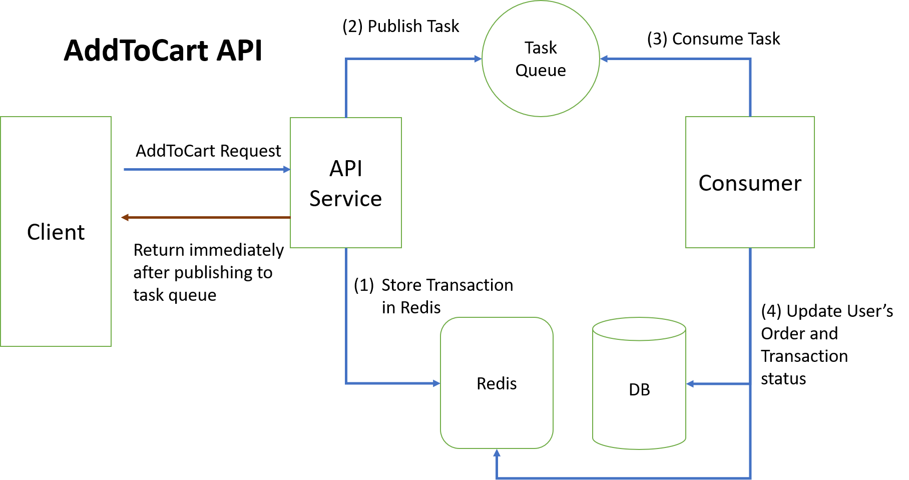

# Task 1: Online Store

## 1. Describe what you think happened that caused those bad reviews during our 12.12 event and why it happened. 
What happen here is a race condition in the inventory operation due to handling a lot of incoming traffic simultaneously (flash sale products performed well, meaning many users attempted to buy them). Multiple access to the inventory quantity data of a product without proper mutually exclusive access control is causing incorect reading of the product availability in the stock, i.e, invetory oversold. 

Negative inventory quantity also could happen during inventory oversold since multiple requests is made and all of them are updating inventory quantity without knowing the correct value of the data. Supposedly there should be 1 stock left in the inventory of a product, if multple users are requesting to buy that particular product on the same time, without proper mutex/atomical access and update, all of them could mistakenly read the value of the inventory stock to 1, and they completed the transaction and trigger the system to decrement the value by one for each request handling, thus, causing the end result to be a negative value.

## 2. Based on your analysis, propose a solution that will prevent the incidents from occurring again
In order to prevent this for happening again, we need to add some synchronization such as mutex or atomicity when accessing the value of the inventory quantity. however, bad implementation of this solution can cuase a huge degradation in the performance, especially during high traffic event such as 12.12 flash sale. 
An example of bad implementation is by adding some locking mechanisme before accessing the table on database each time we want to read the value in order to make sure each reading are mutually exclusive. 

In this situation, best solution would be to:

1. Implement a processing queue for each request. This will ensure the request is done in sequential manner and will prevent race condition. Everytime user request for purchasing a product, the system will immediately enqueue the task and return the response. Afterwards the task will be processed internally and user can check if the purchasing/adding to cart is success or fail due to out of stock. 
    
    API endpoints:
    
    * /api/v1/order/addToCart: POST
    * /api/v1/transaction/{id}: GET

    To implement this solution, we need to use a message queue. Of course it is good to make use of available open source solution such as rabbitMQ or even redis as a meessage queue.
    
    This solution also require additional API to check the transaction status, i.e., before the transaction is completed (successfully adding product to the cart) frontend needs to call this API periodically.

2. Manage the inventory quantity in a platform with good atomicity and thread safe operation such as redis. Redis is single threaded so all operations are guaranteed to be atomic. And since redis cache the data in the memory, it has much higher performance than the usual RDBMS platforms. 

    API endpoints:

    * /order/addToCart: POST

    With this solution, there are no additional API endpoint to complete the transaction. However we still need a sync mechanism from the redis cache to the underlying database.

## 3. Based on your proposed solution, build a Proof of Concept that demonstrates technically how your solution will work.

To demonstrate how the solution works, I will implment proposal no. 1. Due to time limitation, I will not implement no. 2 this time.

In this implementation I am using a [redis message queue library](https://github.com/adjust/rmq) to implement the task queue .

To run this application in solo mode (without docker), simply build and run with ```go run``` command. Make sure you have a mysql server and a redis instance running. Also, adjust the setting in ```configs/app_config.yml``` as well.

```
go run main.go
```
To run this application in docker, build the app image and run with docker-compose

```
cd docker
docker-compose build
docker-compose up -d
```

to run the test locally, build the functionality test program inside ```cmd``` directory

```
go build -o build/func_test cmd/functional_testing.go 
./build/func_test
```

The funcitonality test will setup the necessary database seeding and do the clean up after the test is completed.
In the test scenario, it will run multiple test case of number of simultaneous requests, with the inventory quantity is only half of the total request. Each request will attempt add one item to the cart (the assumption is each request come from a unique user). In each test case we can see even with the increasing number of requests, only half of them are able to successfully add one item to their carts, and the other half failed.

~~Due to limited environment I cannot confirm solution with number of request larger than few hundreds since I am using VM with limitted resources. However with more resourceful environment and some proper time to debug I think this solution can scale.~~

**Update** : I originally use database to store transaction data. This causing a huge performance problem especially when dealing wih more than `300` requests simultaneously. However I have improved this by using redis as trancsaction data storage instead of database. Now the server can easily handle up to `1000` requests simultaneously in my fairly low resource environment!  

The final architecture of the API is shown in this picture




Finally, I also add [postman collection](evermos-test.postman_collection.json) for the APIs for testing purpose.


**For Additional Points**

I Have deployed API service on a cloud instance accessable publicly.

Base URL: http://149.129.255.56

The database is also accessable publicly for testing purpose (updating inventory)
host: 149.129.255.56
port: 5555

Detail on db connection, please see config file.
